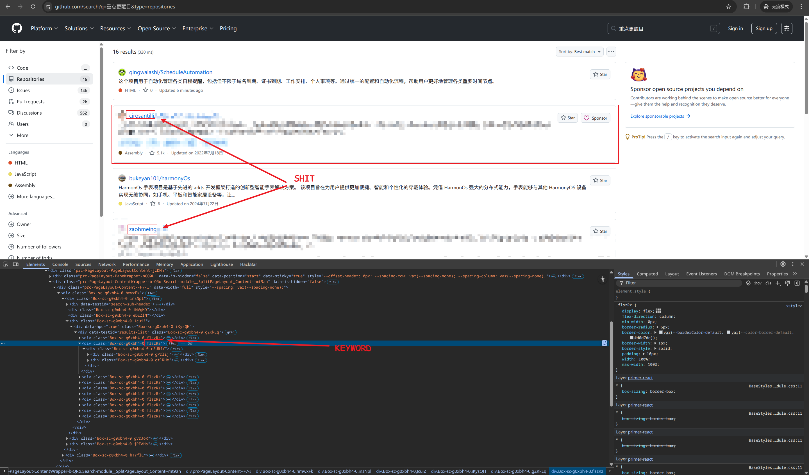

# Blockchain Protocol Zone

block shit.

## reg

1. `<div id="J_TBPC_POP_home"> ... </div>` for `domain.com##div[id="J_TBPC_POP_home"]`
2. `<div class="umc-equity"><` for `jd.com##div.umc-equity`
3. `<div class="dialog-wrap dialog-account-safe">` for `zhipin.com##div.dialog-wrap.dialog-account-safe`
4. 

## rule

### github

#### find KEYWORD



KEYWORD may change depends on github, feel free to find it out.

```markdown
github.com#?#div.Box-sc-62in7e-0.fXzjPH:-abp-has(a:-abp-contains(cheezcharmer))
github.com#?#div.Box-sc-62in7e-0.fXzjPH:-abp-has(a:-abp-contains(Dimples1337))
github.com#?#div.Box-sc-62in7e-0.fXzjPH:-abp-has(a:-abp-contains(zaohmeing))
github.com#?#div.Box-sc-62in7e-0.fXzjPH:-abp-has(a:-abp-contains(zhaohmng-outlook-com))
github.com#?#div.Box-sc-62in7e-0.fXzjPH:-abp-has(a:-abp-contains(codin-stuffs))
github.com#?#div.Box-sc-62in7e-0.fXzjPH:-abp-has(a:-abp-contains(zpc1314521))
github.com#?#div.Box-sc-62in7e-0.fXzjPH:-abp-has(a:-abp-contains(b0LBwZ7r5HOeh6CBMuQIhVu3-s-random-fork))
github.com#?#div.Box-sc-62in7e-0.fXzjPH:-abp-has(a:-abp-contains(panbinibn))
github.com#?#div.Box-sc-62in7e-0.fXzjPH:-abp-has(a:-abp-contains(pxvr-official))
github.com#?#div.Box-sc-62in7e-0.fXzjPH:-abp-has(a:-abp-contains(cirosantilli))
github.com#?#div.Box-sc-62in7e-0.eLyVAI:-abp-has(a:-abp-contains(cheezcharmer))
github.com#?#div.Box-sc-62in7e-0.eLyVAI:-abp-has(a:-abp-contains(Dimples1337))
github.com#?#div.Box-sc-62in7e-0.eLyVAI:-abp-has(a:-abp-contains(zaohmeing))
github.com#?#div.Box-sc-62in7e-0.eLyVAI:-abp-has(a:-abp-contains(zhaohmng-outlook-com))
github.com#?#div.Box-sc-62in7e-0.eLyVAI:-abp-has(a:-abp-contains(codin-stuffs))
github.com#?#div.Box-sc-62in7e-0.eLyVAI:-abp-has(a:-abp-contains(zpc1314521))
github.com#?#div.Box-sc-62in7e-0.eLyVAI:-abp-has(a:-abp-contains(b0LBwZ7r5HOeh6CBMuQIhVu3-s-random-fork))
github.com#?#div.Box-sc-62in7e-0.eLyVAI:-abp-has(a:-abp-contains(panbinibn))
github.com#?#div.Box-sc-62in7e-0.eLyVAI:-abp-has(a:-abp-contains(pxvr-official))
github.com#?#div.Box-sc-62in7e-0.eLyVAI:-abp-has(a:-abp-contains(cirosantilli))
```

### ad

```markdown
taobao.com##div[id="J_TBPC_POP_home"]
taobao.com##div.custom-pop-tmpl-wrapper
jd.com##div.umc-equity
jd.com##div[id="jingyanWrapperBox"]
jd.com##div[id="J_promotional-top"]
jd.com##div[id="J_fs_act"]
zhipin.com##div.dialog-wrap.dialog-account-safe
douban.com##div.ui-overlay-mask
xueqiu.com##div.modals.dimmer.js-shown
xueqiu.com##footer[id="footer_footer_2F1"]
```

## tampermonkey

我发现上面的 github 规则，有的关键词屏蔽不掉 shit，写了个油猴的 [脚本](https://github.com/sparkuru/slumbernana-monkey/blob/%E9%A6%99%E8%95%89%E5%85%B1%E5%92%8C%E5%9B%BD/src/02-adblock/app.js) 用作项目补充